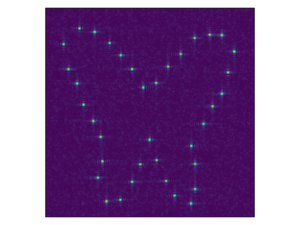

# qgh

[](https://github.com/XingyuZhang2018/qgh.jl/actions/workflows/CI.yml?query=branch%3Amain)
[](https://codecov.io/gh/XingyuZhang2018/qgh)


This is a Julia project for quantum graph homology.

## Installation
```shell
> git clone https://github.com/XingyuZhang2018/qgh
```
move to the file and run `julia REPL`, press `]` into `Pkg REPL`
```julia
(@v1.11) pkg> activate .
Activating project at `~/qgh`
```

```julia
(qgh) pkg> instantiate
```

## Overview
There are four main parts in this project:
- `src/`: the source code of the project
- `example/`: the example of the butterfly graph
- `project/`: the plots of all the results in paper [Dynamic Hologram Generation with Automatic Differentiation](https://arxiv.org/abs/...)
- `benchmark/`: the benchmark of the project with CPU and GPU acceleration

## Basic Usage Example: Continuous Evolution of Butterfly Graph
Here's a step-by-step guide to generate the continuous evolution animation:

### Start Julia REPL and activate the project
```julia

$ julia

(@v1.11) pkg> activate .
Activating project at `~/qgh`

(qgh) pkg> 
```
### Load required packages
press `Backspace` into `Julia REPL`
```julia
julia> using qgh
julia> using Random
julia> using CUDA  # Optional for GPU acceleration

###  Set random seed for reproducibility
```julia
julia> Random.seed!(42)
```
###  Include the layout example file
```julia
julia> include("layout_example.jl")
```
###  Choose array type (Array for CPU, CuArray for GPU)
```julia
julia> atype = Array
```
###  Create initial and target layouts
```julia
julia> layout = atype(layout_example(Val(:butterflycontinuous); α = 0.00))
julia> layout_new = atype(layout_example(Val(:butterflycontinuous); α = 0.2))
```
###  Initialize SLM (Spatial Light Modulator)
```julia
julia> slm = atype(SLM(100))
```
###  Configure the WGS algorithm
```julia
julia> algorithm = WGS(maxiter=100, verbose=true, show_every=10, tol=1e-10, ratio_fixphase=0.8)
```
###  Run the evolution process
```julia
julia> layouts, slms = evolution_slm_flow(layout, layout_new, slm, algorithm)
```
more details about the `evolution_slm_flow` function can be found in the [annotation](https://github.com/XingyuZhang2018/qgh/blob/main/src/evolution/gradient_flow.jl#L127-L153).
###  Generate and save animation
```julia
julia> qgh.image_animation(slms, 200; file = "example/butterflycontinuous.gif")
```

The generated animation will look like this:

